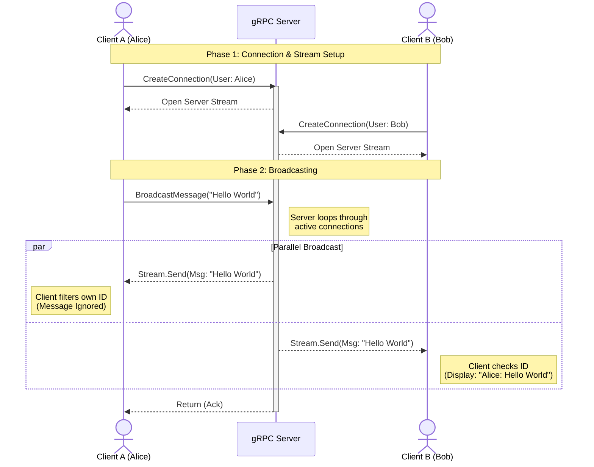

# gRPC Messenger CLI

This project is a practical exploration of gRPC patterns in Go. It implements a terminal-based messenger application demonstrating **Server-Side Streaming**, **Message Broadcasting**, and **Concurrent Client Handling**.

## 1. System Architecture

The application follows a standard Client-Server model using gRPC for transport.

* **gRPC Server:** Acts as the central hub. It manages active user connections and handles the broadcasting logic.
* **CLI Clients:** Lightweight terminals that connect to the server to send messages (RPC) and receive messages (Stream).

### 1.1 gRPC Service Definition
The system relies on a `Broadcast` service with two key methods:
1.  `CreateConnection`: Establishes a long-lived **Server Streaming** connection to push new messages to the client.
2.  `BroadcastMessage`: A standard RPC call used by clients to publish a message to the server.

## 2. Message Flow Diagram

The following diagram illustrates how two clients (Alice and Bob) connect, and how a message sent by Alice is propagated to Bob.

## 3. Implementation Details
### Server Side
The server is responsible for connection management and concurrency.
- **Listener:** Starts a TCP listener on port `:8080`.
- **Connection Pool:** Maintains a list of active connection pointers.
- **Concurrency:** When `BroadcastMessage` is called, the server spawns goroutines to push the message into the streaming channels of all active clients. It waits for all sends to complete using a `WaitGroup` before acknowledging the sender.

### Client Side
The client handles user input and rendering simultaneously.
- **Initialization:** Prompts for a username and generates a unique ID.
- **Streaming (Receiver):** Spawns a background goroutine that continuously listens to the `CreateConnection` stream. It checks the `sender_id` of incoming messages; if it matches the local ID, the message is ignored (deduplication).
- **Broadcasting (Sender):** The main thread captures `stdin` (user input) and triggers the `BroadcastMessage` RPC to send data to the server.
